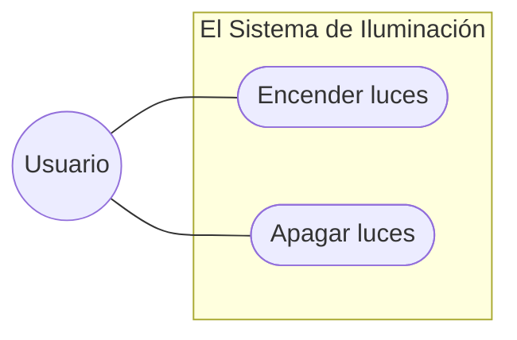
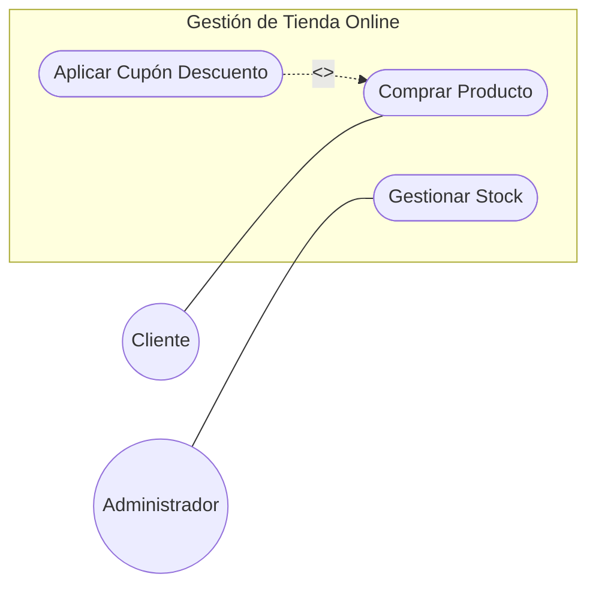
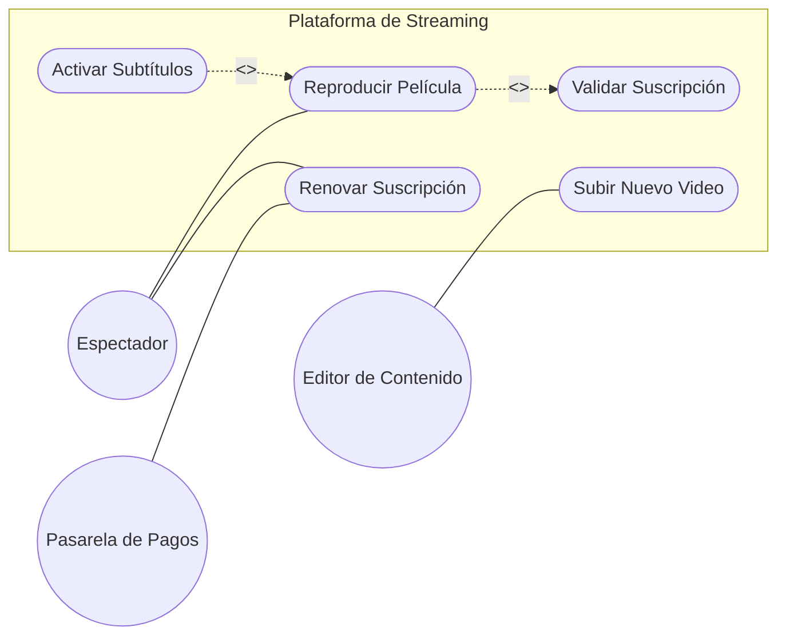

# Entornos-7.2

**# Entornos-7.2 - CASOS DE USO

## Ej 1: El Sistema de Iluminación Inteligente

**Contexto:** Queremos modelar una aplicación móvil sencilla para controlar las luces de una casa.

* **Actores:** Un **Usuario**.
* **Funcionalidades:** El usuario debe poder "Encender luces" y "Apagar luces".
* **Reto:** Representar la interacción básica actor-sistema.

---

## Ej 2: Gestión de Tienda Online

**Contexto:** Un sistema de comercio electrónico donde interactúan diferentes perfiles.

* **Actores: Cliente** y **Administrador**.
* **Funcionalidades:**

  * El **Cliente** puede "Comprar Producto".
  * El **Administrador** puede "Gestionar Stock".
* **Relaciones Especiales:** Al "Comprar Producto", el sistema permite de forma opcional "Aplicar Cupón Descuento" (si el cliente tiene uno).
* **Reto:** Aplicar correctamente la relación de extensión (<`<extend>`>).

---

## Ej 3: Complejo - Plataforma de Streaming (Estilo Netflix)

**Contexto:** Un sistema con dependencias obligatorias y múltiples actores, incluyendo sistemas externos.

* **Actores: Espectador**, **Editor de Contenido** y un sistema externo llamado **Pasarela de Pagos**.
* **Funcionalidades y Relaciones:**

  * El **Espectador** puede "Reproducir Película". Para ello, el sistema debe "Validar Suscripción" obligatoriamente cada vez.
  * Al "Reproducir Película", el espectador tiene la opción de "Activar Subtítulos".
  * El **Editor de Contenido** puede "Subir Nuevo Video".
  * El sistema debe permitir "Renovar Suscripción", proceso que requiere la comunicación con la **Pasarela de Pagos**.
* **Reto:** Gestionar el límite del sistema, actores externos y la relación de inclusión (<`<include>`>).

**
